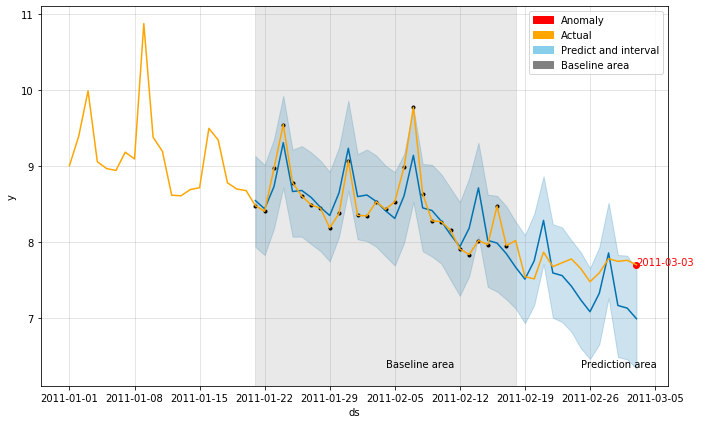
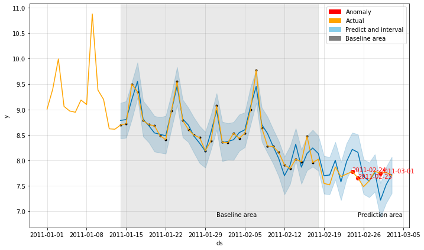

## Time-series Anomaly Detection with Prophet

Time-series anomaly detection with [Prophet](https://facebook.github.io/prophet/), Facebook's open-source library ([github](https://github.com/facebook/prophet))

## Usage

As shown in the [example notebook](./example.ipynb), we added [utility functions](https://github.com/paullo0106/prophet_anomaly_detection/blob/master/utils.py) based on Facebook's Prophet time-series forecast library,
to quickly experiment different model setting, time windows, and visualize the results in an intuitive manner.

Example 1
```
from utils import prophet_fit, prophet_plot, get_outliers
from fbprophet import Prophet

# load and pre-process the dataframe
df = ......

# configure the model
model = Prophet(interval_width=0.98, 
                yearly_seasonality=False, 
                weekly_seasonality=False, 
                changepoint_prior_scale=0.1)
model.add_seasonality(name='weekly', period=7, fourier_order=3, prior_scale=0.1)

# specify the time frames
today_index = 48
print('Cutoff date:', df.index[today_index])
predict_n = 14
lookback_n = 28

# Fit the model, flag outliers, and visualize
fig, forecast, model = prophet_fit(df, model, today_index, 
                                   lookback_days=lookback_n, 
                                   predict_days=predict_n)
outliers, df_pred = get_outliers(df, forecast, today_index, predict_days=predict_n)
prophet_plot(df, fig, today_index, lookback_days=lookback_n, 
             predict_days=predict_n, outliers=outliers)
```

Std output :
```
Cutoff date: 2011-02-18 00:00:00
Use the data from 2011-01-21 00:00:00 to 2011-02-17 00:00:00 (28 days)
Predict 2011-02-18 00:00:00 to 2011-03-03 00:00:00 (14 days)
=====
actual value 7.70481192293259 fall outside of the prediction interval
interval: 6.3404198851091795 to 7.6402990998391225
Date: 2011-03-03
```


Example 2
```
# config the model
model = Prophet(interval_width=0.98,
                     yearly_seasonality=False,
                     weekly_seasonality=False,
                     changepoint_prior_scale=0.1)
model.add_seasonality(name='monthly', period=30.5, fourier_order=5)
model.add_seasonality(name='weekly', period=7, fourier_order=3, prior_scale=0.1)

# specify the time frames
today_index = 48
print('Cutoff date:', df.index[today_index])
predict_n = 14
lookback_n = 35

# Fit the model, flag outliers, and visualize
fig, forecast, model = prophet_fit(df, model, today_index,
                                   lookback_days=lookback_n,
                                   predict_days=predict_n)
outliers, df_pred = get_outliers(df, forecast, today_index, predict_days=predict_n)
prophet_plot(df, fig, today_index, lookback_days=lookback_n,
             predict_days=predict_n, outliers=outliers)
```

Std output :
```
Cutoff date: 2011-02-18 00:00:00
Use the data from 2011-01-14 00:00:00 to 2011-02-17 00:00:00 (35 days)
Predict 2011-02-18 00:00:00 to 2011-03-03 00:00:00 (14 days)
=====
actual value 7.7823903355874595 fall outside of the prediction interval
interval: 7.868278479687891 to 8.546107902866575
Date: 2011-02-24
=====
actual value 7.6563371664301805 fall outside of the prediction interval
interval: 7.793141580354593 to 8.512060734449028
Date: 2011-02-25
=====
actual value 7.750614732770409 fall outside of the prediction interval
interval: 6.882463867086292 to 7.5521676216849984
Date: 2011-03-01
```



## More information

* Medium post: [Here](https://medium.com/@paullo0106/time-series-forecast-anomaly-detection-with-facebook-prophet-558136be4b8d?)
* Facebook's Prophet library: [Docs](https://facebook.github.io/prophet/docs/quick_start.html)
